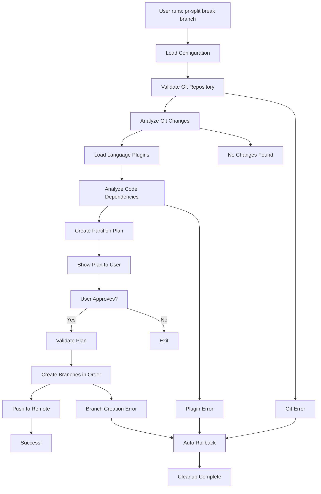

# 🚀 PR Splitter CLI

[](https://golang.org/)
[](LICENSE)
[]()

**Transform large, unwieldy pull requests into smaller, focused, and reviewable chunks.**

PR Splitter CLI intelligently analyzes your git changes and automatically splits them into smaller, logically grouped branches based on file dependencies and code relationships.

---

## 🎯 **What Does It Do?**

**Turn this overwhelming PR:**
```
feature/auth-system (47 files changed)
├── Authentication logic
├── User interface components  
├── Database migrations
├── API endpoints
├── Tests and configuration
└── Documentation updates
```

**Into this manageable series:**
```
pr-split-1-auth-core (8 files) → Ready for review
pr-split-2-auth-api (12 files) → Depends on #1  
pr-split-3-auth-ui (15 files) → Depends on #2
pr-split-4-auth-tests (12 files) → Depends on #1,#2,#3
```

Each partition is:
- ✅ **Logically grouped** - Related changes stay together
- ✅ **Dependency-aware** - No broken builds between PRs
- ✅ **Reviewable size** - 5-15 files per PR for optimal review
- ✅ **Merge-ready** - Proper order ensures clean integration

---

## 🚀 **Quick Start** (60 seconds)

### 1. **Install**
```bash
# Clone and build
git clone https://github.com/BhaveshSonalkar/pr-splitter-cli.git
cd pr-splitter-cli
go build -o pr-split cmd/pr-split/main.go

# Make it globally available
chmod +x pr-split
sudo mv pr-split /usr/local/bin/
```

### 2. **Use It** (Zero configuration needed!)
```bash
# Switch to your large feature branch
git checkout feature/my-large-feature

# Split it into manageable PRs  
pr-split break feature/my-large-feature

# That's it! ✨
```

### 3. **What Happens Next**
The tool will automatically:

1. **Analyze your changes** - Compares your branch to `main`
2. **Understand dependencies** - Uses AST parsing to find code relationships  
3. **Create smart partitions** - Groups related files while respecting dependencies
4. **Show you the plan** - Let you review before creating branches
5. **Create and push branches** - Ready-to-use branches appear in your repo

**Example output:**
```
🔍 Analyzing changes between feature/auth-system and main...
📊 Found 47 changed files with 2,847 additions and 234 deletions

🧠 Analyzing dependencies with plugins...
🔗 Found 23 dependencies

📦 Creating partition plan...
📋 Created 4 partitions

✅ Partition 1: Authentication Core (8 files)
  📁 src/auth/types.ts, interfaces.ts, constants.ts...
  
✅ Partition 2: Authentication Services (12 files)  
  📁 src/auth/services/authService.ts, tokenService.ts...
  
✅ Partition 3: Authentication UI (15 files)
  📁 src/components/LoginForm.tsx, AuthGuard.tsx...
  
✅ Partition 4: Tests & Config (12 files)
  📁 tests/auth/*.test.ts, config/auth.config.ts...

🤔 Proceed with creating these branches? [y/N]: y

🌿 Creating branches and pushing to remote...
✅ Successfully created 4 branches ready for PRs!
```

---

## 📖 **How It Works Under The Hood**

Understanding the process helps you get better results:

### **Step 1: Git Analysis** 
- Compares your feature branch to target (usually `main`)
- Identifies all changed files and their modification types
- Counts additions, deletions, and renames

### **Step 2: Dependency Analysis**
- Uses language-specific plugins to parse your code
- Finds imports, exports, function calls, and type references
- Builds a dependency graph showing which files depend on others
- **Supports:** TypeScript/JavaScript (built-in), Python (built-in), more via plugins

### **Step 3: Smart Partitioning** 
- Groups files that belong together (same module, shared dependencies)
- Respects dependency order (base files before dependent files)
- Handles circular dependencies by keeping them in the same partition
- Balances partition sizes (default: 5-15 files each)

### **Step 4: Branch Creation**
- Creates branches in dependency order from your target branch
- Applies only the relevant changes to each branch  
- Pushes branches to remote automatically
- Validates that each branch builds correctly

### **Step 5: Cleanup Tools**
- Provides rollback commands to clean up if needed
- Maintains branch relationships for proper merge order

---

## 🔧 **Configuration Options**

### **Basic Usage Patterns**

```bash
# Use defaults (target=main, prefix=pr-split, max-size=15)
pr-split break feature/my-branch

# Specify target branch  
pr-split break feature/my-branch --target develop

# Use custom branch prefix
pr-split break feature/my-branch --prefix auth-split

# Smaller partitions (good for complex code)
pr-split break feature/my-branch --max-size 8

# Non-interactive mode (CI/automation)
pr-split break feature/my-branch --non-interactive
```

### **Configuration File** *(Optional)*

Create `.pr-splitter.yaml** only if you want to change defaults:

```yaml
# Example: Customize for your project
target_branch: "develop"        # Your main branch  
branch_prefix: "review-split"   # Custom prefix
max_partition_size: 12          # Slightly smaller PRs
excluded_paths:                 # Skip these files
  - "vendor/"
  - "*.generated.ts"
  - "dist/"
```

### **All Command Options**

```bash
pr-split break <source-branch> [flags]

Flags:
  -t, --target string        Target branch (default "main")
  -p, --prefix string        Branch prefix (default "pr-split")  
  -s, --max-size int         Maximum files per partition (default 15)
  -d, --max-depth int        Maximum dependency depth (default 10)
  -c, --config string        Config file path
      --non-interactive      Run without prompts using defaults
  -h, --help                 Help for break
```

---

## 🧩 **Common Use Cases & Examples**

### **Large Feature Development**
```bash
# Before: 45-file authentication system PR
pr-split break feature/auth-system

# After: 4 focused PRs
# 1. pr-split-1-auth-types (core types & interfaces)
# 2. pr-split-2-auth-services (business logic) 
# 3. pr-split-3-auth-components (UI components)
# 4. pr-split-4-auth-integration (tests & config)
```

### **Refactoring Projects**  
```bash
# Before: 60-file API refactor PR
pr-split break refactor/api-v2 --max-size 10

# After: 6 smaller, focused refactor PRs
# Each partition handles one logical piece of the refactor
```

### **Bug Fixes with Side Effects**
```bash
# Before: Bug fix that touched many files
pr-split break bugfix/user-permissions --target develop

# After: Separate the core fix from related cleanups
```

---

## 🛡️ **Rollback & Cleanup**

### **Automatic Safety**
If anything goes wrong, the tool automatically:
- Stops immediately
- Deletes any partial branches
- Returns you to your original branch  
- Leaves your working directory unchanged

### **Manual Cleanup**
```bash
# Clean up all branches with default prefix
pr-split rollback pr-split

# Clean up branches with custom prefix
pr-split rollback auth-split

# Preview what would be deleted (coming soon)
pr-split rollback --dry-run pr-split
```

### **What Gets Cleaned Up**
- ✅ Local branches matching the prefix
- ✅ Remote branches (if they were pushed)
- ✅ Returns you to a safe branch (main/master)
- ❌ **Never touches** your original feature branch

---

## 🔌 **Plugin System**

### **Built-in Language Support**

| Language | Features | Status |
|----------|----------|---------|
| TypeScript/JavaScript | Import/export analysis, AST parsing, circular dependency detection | ✅ Ready |
| Python | Import tracking, function dependencies, module analysis | ✅ Ready |

### **How Plugins Work**
1. **Automatic Discovery** - Tool finds plugins in `plugins/` directory
2. **Language Detection** - Matches file extensions to plugin capabilities  
3. **AST Analysis** - Each plugin parses code to understand relationships
4. **Dependency Output** - Plugins return structured dependency information

### **Creating Custom Plugins**

Add support for your language:

```bash
plugins/
├── my-language/
│   ├── plugin.json     # Plugin metadata
│   └── analyzer.py     # Your analysis script
```

**plugin.json:**
```json
{
  "name": "My Language Analyzer",
  "executable": "analyzer.py",
  "extensions": [".mylang", ".ml"],
  "runtime": "python3",
  "version": "1.0.0"
}
```

**analyzer.py:**
```python
import sys
import json

def analyze_dependencies(file_path, content):
    # Your language-specific analysis logic
    dependencies = []
    # ... parse imports, function calls, etc.
    return dependencies

# Read input from tool
file_path = sys.argv[1] 
with open(file_path, 'r') as f:
    content = f.read()

# Analyze and output JSON
deps = analyze_dependencies(file_path, content)
print(json.dumps({"dependencies": deps}))
```

---

## 🏗️ **Project Architecture**

### **Core Components**
```
pr-splitter-cli/
├── cmd/pr-split/          # Main CLI entry point
├── internal/
│   ├── cli/               # Command definitions & user interaction
│   ├── splitter/          # Main orchestration logic  
│   ├── git/               # Git operations & branch management
│   ├── plugin/            # Plugin discovery & execution
│   ├── partition/         # File grouping algorithms
│   ├── validation/        # Safety checks & validation
│   ├── config/            # Configuration management
│   └── types/             # Shared data structures
└── plugins/               # Language-specific analyzers
    ├── typescript/        # TypeScript/JavaScript support
    └── python/            # Python support
```

### **Processing Flow**


---

## 🔍 **Troubleshooting**

### **Common Issues**

**"No changes found between branches"**
```bash
# Make sure you're comparing the right branches
pr-split break feature/my-branch --target main

# Check if your branch has uncommitted changes
git status
```

**"Plugin analysis failed"**
```bash
# Check if Node.js is installed (for TypeScript plugin)
node --version

# Check if Python is available (for Python plugin)  
python3 --version
```

**"Failed to create branches"**
```bash
# Make sure you have push permissions
git push origin main

# Check if remote branches already exist
git branch -r | grep pr-split
```

### **Getting Help**

1. **Check the basics**: Git repository, uncommitted changes, branch names
2. **Run with verbose output**: Use `--help` flag for detailed options  
3. **Test with small changes**: Start with a branch that has 5-10 file changes
4. **Use rollback**: `pr-split rollback pr-split` to clean up and try again

---

## 🎉 **Success Stories**

**"Reduced review time from 2 weeks to 3 days"** - Large auth system refactor
**"Finally got my 80-file PR merged"** - API migration project  
**"Team velocity increased 40%"** - Microservices refactoring
**"No more 'LGTM without detailed review'"** - Better code quality

---

## 📚 **More Resources**

- **[Installation Guide](docs/installation.md)** - Detailed setup instructions
- **[Plugin Development](docs/plugins.md)** - Create custom language support  
- **[Best Practices](docs/best-practices.md)** - Tips for optimal results
- **[Troubleshooting](docs/troubleshooting.md)** - Common issues & solutions

---

**Made with ❤️ for better code reviews and faster development cycles.**

*Transform your large PRs into reviewable, focused changes today!* 