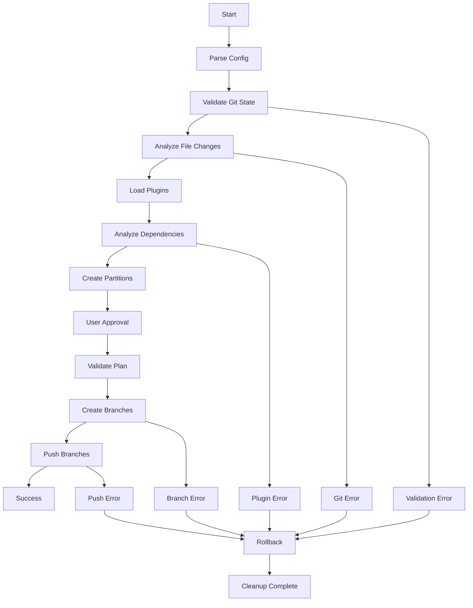

# 🚀 PR Splitter CLI

[](https://golang.org/)
[](LICENSE)
[]()

**Transform large, unwieldy pull requests into smaller, focused, and reviewable chunks.**

PR Splitter CLI intelligently analyzes your git changes and automatically splits them into smaller, logically grouped branches based on file dependencies. **Works immediately with zero configuration** - just point it at your feature branch and go!

## 🎯 **Why PR Splitter?**

- **🔍 Better Code Reviews**: Smaller PRs are easier to review and understand
- **⚡ Faster Merges**: Reduced complexity leads to quicker approval cycles  
- **🛡️ Lower Risk**: Smaller changes mean fewer potential issues
- **🧠 Logical Grouping**: Automatically groups related changes together
- **🔄 Dependency Aware**: Maintains proper dependency order between changes

## ✨ **Features**

### 🎪 **Core Functionality**
- **Intelligent File Analysis**: Uses AST parsing to understand code dependencies
- **Automatic Partitioning**: Groups related files into logical changesets
- **Dependency Resolution**: Maintains proper order for dependent changes
- **Multiple Language Support**: Extensible plugin system for different languages
- **Safe Operations**: Comprehensive rollback mechanism for error recovery

### 🔌 **Plugin System**
- **Dynamic Discovery**: Automatically finds and loads language plugins
- **Easy Extension**: Simple JSON manifest system for adding new languages
- **Built-in Plugins**: TypeScript/JavaScript support out of the box
- **Custom Analysis**: Write your own dependency analyzers

### 🛡️ **Safety & Reliability**
- **Automatic Rollback**: Cleans up on any failure
- **Manual Cleanup**: Dedicated rollback command for manual intervention
- **State Validation**: Comprehensive pre/post operation checks
- **Error Recovery**: Graceful handling of edge cases

## 📦 **Installation**

```bash
# Clone and build
git clone https://github.com/BhaveshSonalkar/pr-splitter-cli.git
cd pr-splitter-cli
go build -o pr-split cmd/pr-split/main.go

# Install globally  
chmod +x pr-split
sudo mv pr-split /usr/local/bin/

# Verify installation
pr-split --help
```

**That's it!** No dependencies, no config files, no setup. Ready to use.

## 🚀 **Quick Start**

### **1. Zero Configuration Usage**

The tool works immediately with sensible defaults - **no config file needed**:

```bash
# 1. Make sure you're on your feature branch
git checkout feature/large-feature-branch

# 2. Split it! (uses target=main, prefix=pr-split)
pr-split break feature/large-feature-branch

# That's it! 🎉
```

### **2. What Happens Next**

The CLI will automatically:

```
🔍 Analyzing changes between feature/auth-system and main...
📊 Found 23 changed files with 847 additions and 234 deletions

🧩 Creating partitions based on dependencies...
✅ Generated 3 partitions:

📦 Partition 1: Authentication Core (8 files)
  📁 src/auth/types.ts
  📁 src/auth/interfaces.ts  
  📁 src/auth/constants.ts
  📁 src/auth/utils.ts

📦 Partition 2: Authentication Services (7 files)  
  📁 src/auth/services/authService.ts
  📁 src/auth/services/tokenService.ts
  📁 src/auth/middleware/authMiddleware.ts

📦 Partition 3: Authentication Components (8 files)
  📁 src/components/LoginForm.tsx
  📁 src/components/AuthGuard.tsx
  📁 src/pages/LoginPage.tsx

🤔 Proceed with creating these branches? [y/N]: y

🌿 Creating branch: pr-split-1-auth-core (from main)
📝 Applying changes to pr-split-1-auth-core (8 files)
⬆️  Pushing branch: pr-split-1-auth-core
✅ Successfully created and pushed branch: pr-split-1-auth-core

🎉 Successfully created 3 branches
```

### **3. Common Variations**

```bash
# Use different target branch
pr-split break feature/large-feature-branch --target develop

# Use custom branch prefix  
pr-split break feature/large-feature-branch --prefix feat-split

# Smaller partitions (max 8 files each)
pr-split break feature/large-feature-branch --max-size 8
```

### **4. What You Get**

After running, you'll have:
- ✅ **Multiple focused branches** (e.g., `pr-split-1-auth-core`, `pr-split-2-auth-services`)  
- ✅ **Proper dependency order** (dependent branches build on previous ones)
- ✅ **All branches pushed to remote** (ready for PRs)
- ✅ **Your original branch unchanged**

### **5. Next Steps**

1. **Create Pull Requests**: Go to GitHub/GitLab and create PRs from each `pr-split-*` branch
2. **Review Order**: Review and merge in dependency order (1 → 2 → 3)
3. **Cleanup**: Use `pr-split rollback pr-split` to cleanup branches when done

## 📖 **Detailed Usage**

### **Command Options**

```bash
pr-split break <source-branch> [flags]

Flags:
  -t, --target string        Target branch (default "main")
  -p, --prefix string        Branch prefix (default "pr-split")  
  -s, --max-size int         Maximum files per partition (default 15)
  -d, --max-depth int        Maximum dependency depth (default 10)
  -c, --config string        Config file path
  -h, --help                 Help for break
```

### **Configuration File** *(Optional)*

**No config file needed!** The tool has sensible defaults. Create a `.pr-splitter.yaml` file **only if** you want to customize defaults:

```yaml
# Only add settings you want to change
target_branch: "develop"           # Default: "main"
branch_prefix: "feature-split"     # Default: "pr-split"  
max_partition_size: 12             # Default: 15
excluded_paths:                    # Add project-specific exclusions
  - "vendor/"
  - "*.generated.ts"
```

**Pro tip**: Start without a config file. Add one later if you find yourself using the same flags repeatedly.

## 🔌 **Plugin System**

### **Available Plugins**

| Language | Plugin | Features |
|----------|--------|----------|
| TypeScript/JavaScript | `typescript` | Import/export analysis, AST parsing |
| Python | `python` | Import dependency tracking *(Example)* |

### **Creating Custom Plugins**

Create a plugin in the `plugins/` directory:

```bash
plugins/
├── my-language/
│   ├── plugin.json
│   └── analyzer.js
```

**plugin.json:**
```json
{
  "name": "my-language",
  "executable": "analyzer.js", 
  "extensions": [".mylang", ".ml"],
  "runtime": "node"
}
```

**analyzer.js:**
```javascript
const fs = require('fs');

const filePath = process.argv[2];
const content = fs.readFileSync(filePath, 'utf8');

// Your analysis logic here
const dependencies = analyzeDependencies(content);

console.log(JSON.stringify({
  file: filePath,
  dependencies: dependencies
}));
```

## 🛡️ **Rollback & Recovery**

### **Automatic Rollback**

If anything goes wrong during branch creation, the tool automatically:

- Stops processing immediately
- Deletes any created branches (local & remote)
- Returns to your original branch
- Preserves your working directory state

### **Manual Cleanup**

```bash
# Clean up branches with specific prefix
pr-split rollback pr-split

# Clean up custom prefix branches  
pr-split rollback feature-auth-split

# Preview what would be deleted
pr-split rollback --dry-run pr-split  # Coming soon
```

See [ROLLBACK.md](ROLLBACK.md) for comprehensive rollback documentation.

## 🏗️ **Architecture**

### **Core Components**

```
pr-splitter-cli/
├── cmd/pr-split/           # CLI entry point
├── internal/
│   ├── cli/               # Command definitions  
│   ├── splitter/          # Main orchestration logic
│   ├── git/               # Git operations & validation
│   ├── plugin/            # Plugin system & management
│   ├── partition/         # Partitioning algorithms
│   ├── validation/        # Pre/post validation
│   ├── config/            # Configuration management
│   └── types/             # Shared data structures
├── plugins/               # Language-specific analyzers
│   ├── typescript/        # TypeScript/JavaScript plugin
│   └── python/            # Python plugin (example)
└── docs/                  # Documentation
```

### **Processing Flow**



**Made with ❤️ for better code reviews and faster development cycles.**

*Transform your large PRs into reviewable, focused changes today!* 